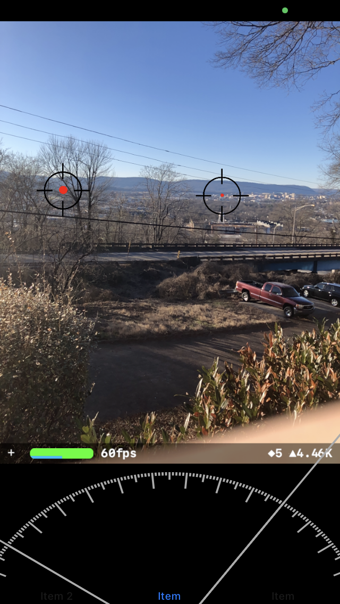

# RavenTrace
RavenTrace is a prototype app to help hikers, outdoor enthusiasts or anyone use their device to locate important places. It's main uses are:
- Searching (using MapKit) for important places or addresses and tracking them in real time via your camera (ARKit). As you pan your environment the phone will place markers on the places you search  and track. This gives you an emmersive, visual experience about where these places are in the distance across the landscape, or behind features like mountains or buildings. This is not even at the MVP stage right now but it "works".
- (not implemented) The ability to land a virtual pin into the landscape using ARKit and have the phone calculate a probably area on a map of where that is.
- (not implemented) Distance estimates between two distant points
- (not implemented) Area estimation
- other ideas... I'm open to suggestions.

The dial at the bottof of the world view screen will be a bearing indicator (a compass) but will paint targets around the arc to give the user a wider understanding that is available visually through the AR view (and what's even behind them). The longer lines are cardinal points (N, S, E and W). 
